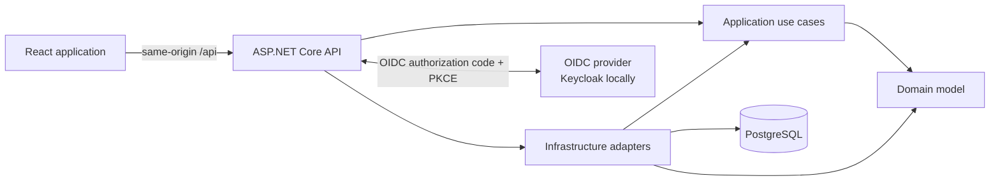
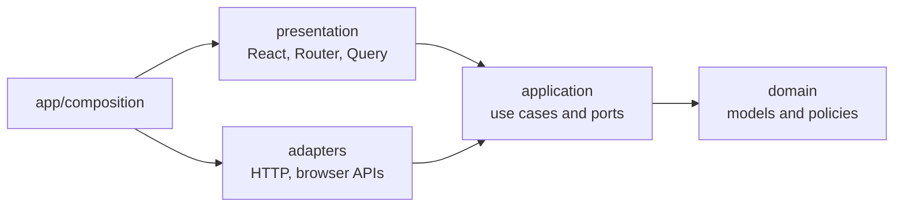

# TaskFlow

TaskFlow is a small project and task manager built to explore full-stack Clean Architecture in a
codebase that is large enough to be realistic and small enough to understand end to end.

The domain is intentionally simple: `User -> Project -> TaskItem`. The focus is on explicit
boundaries, dependency inversion, testable use cases, provider-neutral authentication, and clear
state ownership rather than feature volume.

## Status

The backend, OIDC authentication, and authenticated project vertical slice are implemented. Task UI,
browser-level tests, and production containers remain on the roadmap. See [`PROGRESS.md`](PROGRESS.md)
for the learning journal and detailed implementation history.

## Architecture



### Backend

The backend follows the Clean Architecture dependency rule: dependencies point inward and inner
layers know nothing about delivery or persistence details.

| Project | Depends on | Responsibility |
| --- | --- | --- |
| `TaskFlow.Domain` | Nothing | Entities, value objects, invariants, repository contracts |
| `TaskFlow.Application` | Domain | Use cases, ports, DTOs, validation |
| `TaskFlow.Infrastructure` | Application, Domain | EF Core, PostgreSQL, repository adapters, migrations |
| `TaskFlow.Api` | Application, Infrastructure | Controllers, authentication, middleware, composition root |

Project references enforce these boundaries at compile time. ASP.NET is the composition root and
wires the complete object graph through dependency injection.

### Frontend

The frontend uses feature-first Hexagonal Architecture. A feature creates only the layers it needs:



- TanStack Query owns API and session state.
- TanStack Router owns shareable navigation state.
- React Hook Form owns form values and validation.
- Local React state owns transient interaction state.
- Focused Context providers expose stable injected services, not changing server data.
- HTTP adapters contain generated transport types and map them into application/domain models.
- Dependency Cruiser enforces layer direction and rejects circular imports.

See [`frontend/ARCHITECTURE.md`](frontend/ARCHITECTURE.md) for the complete dependency and state
ownership rules.

### Authentication

The browser talks only to stable TaskFlow endpoints. ASP.NET owns the OpenID Connect flow, tokens,
antiforgery validation, and the secure `HttpOnly` session cookie. React has no identity-provider SDK
and never receives access tokens. Keycloak is therefore a replaceable local adapter rather than an
application dependency.

## Stack

- .NET 10, ASP.NET Core controllers, EF Core, Npgsql, PostgreSQL
- OpenID Connect, secure cookie BFF, Keycloak for local development
- FluentValidation, Problem Details, Serilog, OpenAPI/Swagger
- React 19, TypeScript, Vite, TanStack Router and Query, React Hook Form
- xUnit, NSubstitute, FluentAssertions, Vitest, Dependency Cruiser, Oxlint

## Repository

```text
TaskFlow/
|-- backend/             .NET solution, production projects, and tests
|-- frontend/            React/Vite application and architecture rules
|-- infra/keycloak/      Local OIDC realm configuration
|-- docker-compose.yml   PostgreSQL and Keycloak development services
|-- PROGRESS.md          Learning journal and roadmap
`-- README.md
```

## Run Locally

Prerequisites: .NET 10 SDK, the `dotnet-ef` tool, Docker Compose, and pnpm 10.

From the repository root:

```bash
# Build the backend and start local infrastructure
dotnet build backend/TaskFlow.slnx
docker compose up -d postgres keycloak

# Apply the database migration and run the API
dotnet ef database update --project backend/src/TaskFlow.Infrastructure
dotnet run --project backend/src/TaskFlow.Api
```

In another terminal:

```bash
pnpm --dir frontend install
pnpm --dir frontend dev
```

Open `http://localhost:5173` and sign in with the local development user:

```text
Username: ada
Password: taskflow
```

| Service | URL |
| --- | --- |
| Frontend | `http://localhost:5173` |
| API | `http://localhost:5131` |
| Swagger | `http://localhost:5131/swagger` |
| OpenAPI | `http://localhost:5131/openapi/v1.json` |
| Keycloak | `http://localhost:8080` |

The committed credentials and OIDC client secret are for local development only.

## Quality Gates

```bash
dotnet build backend/TaskFlow.slnx --warnaserror
dotnet test backend/TaskFlow.slnx

pnpm --dir frontend lint
pnpm --dir frontend architecture
pnpm --dir frontend test
pnpm --dir frontend build
```

Run the API before regenerating the TypeScript transport contract:

```bash
pnpm --dir frontend generate:api
```

## Architecture Graphs

The Mermaid diagrams above are hand-maintained conceptual views and render directly on GitHub.
Dependency Cruiser provides implementation-level validation and can also generate a frontend graph:

```bash
cd frontend
pnpm exec depcruise src --config .dependency-cruiser.cjs \
  --include-only '^src' --output-type mermaid
```

Conceptual diagrams should remain small and stable. Generated file-level graphs are useful for local
investigation but become noisy, so they are supplemental rather than the primary documentation.

## Next Steps

- Add Playwright journeys for authentication, project creation, persistence, and logout isolation.
- Add deterministic test-data reset before running full-stack tests in CI.
- Implement the task vertical slice after correcting task enum representation in generated OpenAPI.
- Add API/frontend containers and a production reverse proxy.
