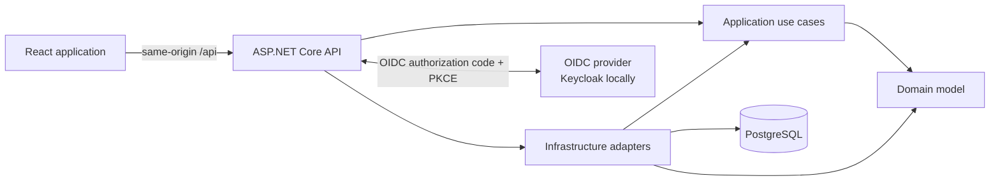
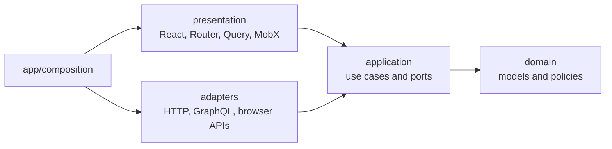

# TaskFlow

[](https://github.com/auauwolff/TaskFlow/actions/workflows/ci.yml)
[](LICENSE)

A reference architecture for full-stack applications: Clean Architecture in .NET on the backend,
feature-first Hexagonal Architecture in React on the frontend, in a codebase small enough to read
end to end and structured to hold up at enterprise size.

The domain is deliberately small — `User -> Project -> TaskItem`. The subject of this repository is
the boundaries, not the feature set. It is built to be read, discussed, and copied from when
starting something new.

## What it demonstrates

- **A dependency rule the compiler enforces.** Backend layering is expressed as project references,
  so an inward violation is a build error rather than a review comment.
- **Ports and adapters on both sides of the wire.** The same seam appears in C# and in TypeScript,
  so the pattern is visible independent of language or framework.
- **Two transports behind one architecture.** Projects use REST, tasks use GraphQL, both reach the
  same application services. Swapping a transport touches one adapter.
- **Provider-neutral authentication.** ASP.NET owns the OIDC flow and an `HttpOnly` cookie; the
  browser never sees a token and no identity-provider SDK reaches frontend code.
- **Rules that fail the build.** Layer direction, cross-feature imports, ambient clock usage, and
  the accuracy of the architecture diagrams are all checked by tooling, not convention.
- **An interactive explorer** that navigates the real dependency graph from full-stack map down to
  source files.

## Interactive architecture explorer

The frontend ships an Nx-style system explorer for this codebase. Start the frontend:

```bash
pnpm --dir frontend dev
```

Then open <http://localhost:5173/architecture>.

Start from the full-stack map, select any node to isolate its dependencies and consumers, then drill
from projects into layers, modules, dependency-injection wiring, and concrete source files with
syntax-highlighted source in the inspector. Two runtime lenses step outside the structural graph: a
**sign-in flow** tracing the authentication path end to end, and a **DI inversion** lens that follows
one port through both arrow systems — with a toggle that deletes the port to show what it was buying.

Suggested tour:

1. **Full stack** — frontend, backend, PostgreSQL, and OIDC dependencies.
2. **Frontend application → In a nutshell** — the frontend with the features removed: one anonymous
   slice and the machinery that serves it. Every feature is a copy of that shape.
3. **Backend solution → TaskFlow.Domain** — entities, value objects, and the repository ports that
   make Infrastructure point inward.
4. **DI inversion**, then press *Delete the port*.

The graph model is curated rather than generated: it shows the files and edges that explain the
architecture instead of dumping every incidental import onto one canvas. It is held to the codebase
by tests — see [Rules that fail the build](#rules-that-fail-the-build).

## Architecture



### Backend

Dependencies point inward. Inner layers know nothing about delivery or persistence.

| Project                   | Depends on                  | Responsibility                                            |
| ------------------------- | --------------------------- | --------------------------------------------------------- |
| `TaskFlow.Domain`         | Nothing                     | Entities, value objects, invariants, repository contracts |
| `TaskFlow.Application`    | Domain                      | Use cases, ports, DTOs, validation                        |
| `TaskFlow.Infrastructure` | Application, Domain         | EF Core, PostgreSQL, repository adapters, migrations      |
| `TaskFlow.Api`            | Application, Infrastructure | Controllers, GraphQL, authentication, composition root    |

Project references enforce these boundaries at compile time. ASP.NET is the composition root and
wires the complete object graph through dependency injection.

Business rules live in the entities: `TaskItem` owns its own state transitions and rejects invalid
ones, rather than exposing setters for a service to orchestrate. Time is injected through
`TimeProvider` so behaviour is testable, and reaching for an ambient clock instead is a compile
error. Optimistic concurrency uses PostgreSQL's `xmin` as a shadow row version, and EF's concurrency
exception is translated into an application-owned `ConflictException` inside Infrastructure so
persistence details never reach a use case.

Both delivery mechanisms are thin. REST controllers and Hot Chocolate GraphQL resolvers call the
same `ITaskService`, and their exception-to-error translators are kept deliberately parallel — a
test asserts the two produce the same vocabulary for the same failure, so a conflict means the same
thing whichever transport reported it.

### Frontend

Feature-first Hexagonal Architecture. A feature creates only the layers it needs; empty ceremonial
layers are avoided.



- `domain` holds models and pure policies. It imports no outer layer.
- `application` defines use-case contracts and ports. It may import `domain`.
- `adapters` implement ports using HTTP, GraphQL, or browser APIs.
- `presentation` adapts application capabilities to React through focused view-model hooks.
- `app` is the composition root, combining feature registrations into one object graph.

#### The feature axis

The rule above governs how code is arranged *inside* one feature. It says nothing about how features
relate to each other, and that is the boundary that actually decays as a codebase grows. Two further
rules govern it:

**A feature imports another feature only through its `index.ts`.** A deep import couples the consumer
to the other feature's internal folder layout, so moving a file becomes a cross-feature change.
`features/session/index.ts` is the only session module another feature may name. `src/app` and
`src/routes` are exempt: wiring features together and mounting pages is precisely their job.

**Shared vocabulary lives in `shared/domain`, and holds vocabulary only.** A type belongs in the
shared kernel when two or more features must agree on it to describe the same thing, and no single
feature may change it unilaterally. `UserId` and `ProjectId` qualify — `Project.ownerId` being a
`UserId` is not the session feature's private opinion. `TaskId` deliberately does not: no other
feature needs to name a task, so it stays in `features/tasks/domain`. That asymmetry is the rule made
visible. The kernel may not import a transport, a cache, or the container; the moment it can, it
stops being vocabulary and becomes the junk drawer every shared kernel dies of.

The result is that one feature-to-feature dependency exists in the codebase — `TaskList` needs the
signed-in user to offer "assign to me" — and it goes through a published surface.

#### Composition and object style

`createAppRuntime()` registers shared infrastructure, invokes each feature's `add*Module()` function,
and builds the object graph before React renders. Feature code never receives the complete runtime or
resolver.

`shared/ioc` is a framework-neutral typed container plus a thin React bridge, deliberately shaped
like `Microsoft.Extensions.DependencyInjection` so both composition roots read the same way. Typed
symbol tokens avoid string collisions and decorators. It rejects missing, duplicate, and circular
registrations, prevents singletons from capturing scoped services, supports child-scope overrides,
and exposes singleton, scoped, and transient lifetimes. Instances are created eagerly at build time,
so `useService()` during render is a pure cache read rather than a side effect. See
[`frontend/src/shared/ioc/README.md`](frontend/src/shared/ioc/README.md) for why the wheel was
rebuilt and what would have to change for an off-the-shelf container to win.

A route or module needing an isolated lifetime wraps its subtree in `ServiceScopeProvider`, passing a
stable resource identity as `scopeKey`:

```tsx
<ServiceScopeProvider scopeKey={projectId} configure={addTasksWorkspaceScope}>
  <ProjectWorkspacePage />
</ServiceScopeProvider>
```

Ports stay TypeScript interfaces. Stateful adapters and application services are constructor-injected
classes. Components, hooks, registration functions, cache configuration, DTO mappings, and pure
domain operations stay functions. A class earns its place through dependency ownership, state,
identity, or lifecycle — not merely because the code lives outside React.

#### State ownership

| State | Owner |
| --- | --- |
| Projects returned by REST | TanStack Query |
| Tasks returned by GraphQL | TanStack Query |
| Current authenticated user | TanStack Query session cache |
| OIDC protocol, tokens, and session cookie | ASP.NET authentication adapter |
| Selected resource and shareable navigation state | Router path/search parameters |
| Form values and validation | React Hook Form |
| Project-scoped task filter | MobX view store (see *Known deviations*) |
| Other local interaction state | React |
| Stable gateways and services | Typed IoC registrations through focused feature hooks |

Server data is never copied into MobX. REST and GraphQL feed one server-state cache, and components
consume TaskFlow-owned presentation models rather than the library's result objects. When state must
be shared, choose its owner by meaning rather than reach: API-derived data belongs to its feature's
server-state engine; selections, filters and sorting belong in the URL; form state belongs to React
Hook Form; transient interaction state lifts to the nearest common component. A client store must
never duplicate Query, Router, or form state.

#### Transport boundary

`openapi-typescript` generates `src/shared/api/schema.d.ts` from the running API, and generated
transport types stay inside HTTP adapters. Adapters map DTOs and RFC Problem Details into frontend
models and `AppError`; components never import generated schemas or call `fetch`.

Tasks use a second delivery path behind an identical seam. `TasksGateway` is a plain application
port; its adapter posts typed GraphQL documents to `/api/graphql`. The GraphQL library is
deliberately demoted to a transport: `shared/graphql/client.ts` is a small typed `fetch` client
carrying the same antiforgery header and 401 policy as the REST client, and resolver errors are
translated through the same code-to-`AppError` table. Swapping a feature's transport replaces its
adapter and nothing else — the port, presentation hooks, component contract, and domain model are
untouched. The heterogeneous transports exist to prove that boundary is real.

Authentication follows the same shape. The session layer depends on an `AuthenticationGateway` whose
adapter calls stable TaskFlow endpoints. ASP.NET owns the OIDC protocol and the session cookie, so
replacing Keycloak with another provider does not change a single frontend feature.

## Rules that fail the build

Architecture that lives only in documentation drifts. Each rule here is executable, and each was
verified to fail before being trusted.

| Rule | Enforced by |
| --- | --- |
| Backend layers may not depend outward | Project references |
| No warnings, current analyzer set, enforced code style | `backend/Directory.Build.props` |
| No ambient clock — inject `TimeProvider` | `backend/BannedSymbols.txt` (RS0030) |
| Frontend layer direction, no circular imports | `.dependency-cruiser.cjs` |
| Cross-feature imports go through the front door | `cross-feature-imports-use-the-front-door` |
| The shared kernel holds vocabulary, not logic | `shared-kernel-holds-vocabulary-not-logic` |
| The architecture explorer still describes this codebase | `architectureModel.test.ts` |
| Migrations still match the EF model | `TaskFlow.Infrastructure.Tests` |
| All of the above, on every push | `.github/workflows/ci.yml` |

The dependency-cruiser configuration sets `tsPreCompilationDeps`, so `import type` counts. A type-only
import is erased at runtime but is still an architectural dependency: a domain layer importing a type
from another feature is coupled to it whether or not the bundler can tell.

Two of these are worth expanding on.

`TaskFlow.Infrastructure.Tests` runs against a disposable PostgreSQL container started by
Testcontainers, because the behaviour it checks belongs to PostgreSQL rather than to C#. An in-memory
or SQLite double would answer the question convincingly and wrongly: neither has an `xmin` system
column, so the concurrency token would silently do nothing and the tests would still pass. The schema
comes from running the real migrations, so a migration that has drifted from the model fails there
too. Docker must be running locally; it is preinstalled on GitHub's Ubuntu runners.

The explorer test is the answer to a specific failure mode — a hand-curated diagram of a moving
codebase rots silently, because a renamed file leaves a dead link and a moved declaration leaves a
confident sentence about code that is no longer there, and nothing fails. It asserts that every
source link resolves, every highlighted snippet is still present in the file it points at, every edge
connects nodes that exist, and every view is reachable. Highlights are anchored by code snippet
rather than line number precisely so that drift breaks the suite instead of quietly mispointing.

## Stack

- .NET 10, ASP.NET Core controllers and Hot Chocolate GraphQL, EF Core, Npgsql, PostgreSQL
- OpenID Connect, secure cookie BFF, Keycloak for local development
- FluentValidation, Problem Details, Serilog, OpenAPI/Swagger
- React 19, TypeScript, Vite, TanStack Router/Query, a typed GraphQL fetch transport, MobX, React Hook Form
- xUnit, NSubstitute, FluentAssertions, Vitest, Playwright, Dependency Cruiser, Oxlint

## Repository

```text
TaskFlow/
|-- backend/             .NET solution, production projects, and tests
|-- frontend/            React/Vite application, architecture rules, and browser tests
|-- infra/keycloak/      Local OIDC realm configuration
|-- docker-compose.yml   PostgreSQL and Keycloak development services
|-- .github/workflows/   CI running every check below
`-- README.md
```

| Test project | Scope | Needs |
| --- | --- | --- |
| `TaskFlow.Domain.Tests` | Entity invariants and state transitions | Nothing |
| `TaskFlow.Application.Tests` | Use-case orchestration over substituted ports | Nothing |
| `TaskFlow.Infrastructure.Tests` | Value converters, concurrency tokens, migrations | Docker |
| `frontend/src/**/*.test.ts` | Domain, adapters, view models, architecture model | Nothing |
| `frontend/e2e` | Real browser, API, PostgreSQL, and Keycloak login | Docker |

## Run locally

Prerequisites: .NET 10 SDK, the `dotnet-ef` tool, Docker Compose, and pnpm 10.

From the repository root:

```bash
# Build the backend and start local infrastructure
dotnet build backend/TaskFlow.slnx
docker compose up -d postgres keycloak

# Apply the database migration and run the API
dotnet ef database update --project backend/src/TaskFlow.Infrastructure
dotnet run --project backend/src/TaskFlow.Api
```

In another terminal:

```bash
pnpm --dir frontend install
pnpm --dir frontend dev
```

Open `http://localhost:5173` and sign in with the local development user:

```text
Username: ada
Password: taskflow
```

| Service  | URL                                     |
| -------- | --------------------------------------- |
| Frontend | `http://localhost:5173`                 |
| Explorer | `http://localhost:5173/architecture`    |
| API      | `http://localhost:5131`                 |
| Swagger  | `http://localhost:5131/swagger`         |
| OpenAPI  | `http://localhost:5131/openapi/v1.json` |
| Keycloak | `http://localhost:8080`                 |

The committed credentials and OIDC client secret are for local development only.

The Vite dev server proxies `/api` to the API, so start the backend before using connected screens.
Route files live in `frontend/src/routes`; `routeTree.gen.ts` is generated and must not be edited.

## Checks

```bash
dotnet build backend/TaskFlow.slnx
dotnet test backend/TaskFlow.slnx

pnpm --dir frontend lint
pnpm --dir frontend architecture
pnpm --dir frontend test
pnpm --dir frontend build
```

The build is the quality bar: `Directory.Build.props` sets warnings-as-errors, analyzers, and
enforced code style solution-wide, so there is no flag to remember. `dotnet test` includes the
Testcontainers-backed persistence tests, so Docker needs to be running.

The browser suite runs against disposable PostgreSQL and Keycloak containers on separate ports. It
does not touch the normal development volumes and can run beside the development stack:

```bash
pnpm --dir frontend exec playwright install chromium
pnpm --dir frontend test:e2e
```

Run the API before regenerating the typed transport contracts:

```bash
pnpm --dir frontend generate:api        # OpenAPI -> TypeScript
pnpm --dir frontend generate:graphql    # SDL export -> typed documents
```

Dependency Cruiser can also emit a file-level graph for local investigation. The Mermaid diagrams
above are hand-maintained conceptual views and should stay small and stable:

```bash
cd frontend
pnpm exec depcruise src --config .dependency-cruiser.cjs \
  --include-only '^src' --output-type mermaid
```

## Scope

Deliberately absent, because they would add volume without adding architectural information:
production containers and a reverse proxy, richer task transitions, collaboration and authorization
beyond single-owner access, and horizontal concerns such as caching, messaging, or background jobs.
The patterns here are meant to survive their addition, not to pre-empt it.

Integration coverage stops at the persistence boundary. The value-converter and concurrency
behaviours are tested against real PostgreSQL because nothing else can prove them; the HTTP surface —
antiforgery, the 401 policy, cross-user isolation — is covered end to end by the Playwright suite
against a real API and a real Keycloak instead of by a second layer of API-level integration tests.

### Known deviations

The project-scoped task filter is shareable, bookmarkable state that survives a reload, which by the
rules on this page makes it router search-param state. It currently lives in a MobX view store, so a
deep link loses the active filter. The store exists mainly to demonstrate the scoped-service pattern,
which is a weak reason for it to own state the rules assign elsewhere. The intended resolution is to
move the filter into `validateSearch` and retire the store. It is recorded here rather than quietly
tolerated.
