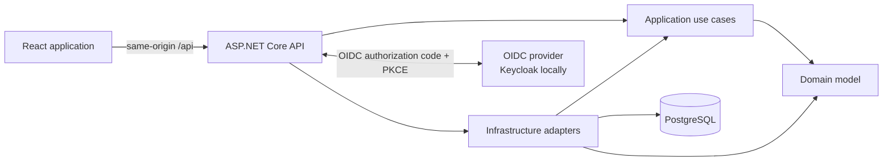
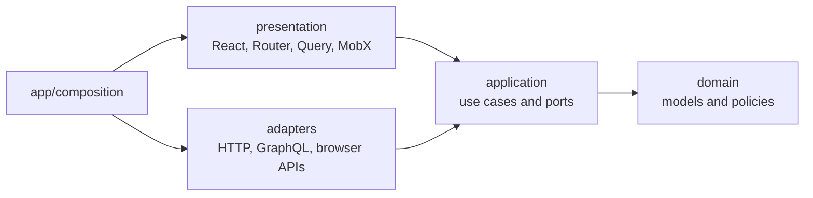

# TaskFlow

TaskFlow is a small project and task manager built to explore full-stack Clean Architecture in a
codebase that is large enough to be realistic and small enough to understand end to end.

The domain is intentionally simple: `User -> Project -> TaskItem`. The focus is on explicit
boundaries, dependency inversion, testable use cases, provider-neutral authentication, and clear
state ownership rather than feature volume.

## Status

The backend, OIDC authentication, project/task workflows, deep-linkable project workspaces, and
isolated browser journeys are implemented. Production containers and richer task transitions remain
on the roadmap. See [`PROGRESS.md`](PROGRESS.md) for the learning journal and implementation history.

## Architecture

### Interactive Explorer

The frontend includes an Nx-style system explorer. Start the application frontend:

```bash
pnpm --dir frontend dev
```

Then open <http://localhost:5173/architecture>. Start from the complete full-stack map, select any
node to isolate its dependencies and consumers, then drill from frontend/backend projects into layers,
modules, dependency-injection wiring, and concrete source files.
Dedicated sign-in and task-request lenses animate the important end-to-end paths. Source links in the
inspector connect conceptual nodes back to their implementation. See
[`frontend/ARCHITECTURE-EXPLORER.md`](frontend/ARCHITECTURE-EXPLORER.md) for the interaction guide.



### Backend

The backend follows the Clean Architecture dependency rule: dependencies point inward and inner
layers know nothing about delivery or persistence details.

| Project                   | Depends on                  | Responsibility                                            |
| ------------------------- | --------------------------- | --------------------------------------------------------- |
| `TaskFlow.Domain`         | Nothing                     | Entities, value objects, invariants, repository contracts |
| `TaskFlow.Application`    | Domain                      | Use cases, ports, DTOs, validation                        |
| `TaskFlow.Infrastructure` | Application, Domain         | EF Core, PostgreSQL, repository adapters, migrations      |
| `TaskFlow.Api`            | Application, Infrastructure | Controllers, authentication, middleware, composition root |

Project references enforce these boundaries at compile time. ASP.NET is the composition root and
wires the complete object graph through dependency injection.

### Frontend

The frontend uses feature-first Hexagonal Architecture. A feature creates only the layers it needs:



- TanStack Query owns project, session, and task server state; REST and GraphQL are transports feeding it.
- A project-scoped MobX view store owns task-filter interaction state without copying server data.
- TanStack Router owns shareable navigation state.
- React Hook Form owns form values and validation.
- Local React state owns component-local transient interaction state.
- The typed IoC provider exposes stable injected services and project-scoped stores, not server data.
- REST and GraphQL boundaries map transport values into application/domain models.
- Dependency Cruiser enforces layer direction and rejects circular imports.

See [`frontend/ARCHITECTURE.md`](frontend/ARCHITECTURE.md) for the complete dependency and state
ownership rules.

### Authentication

The browser talks only to stable TaskFlow endpoints. ASP.NET owns the OpenID Connect flow, tokens,
antiforgery validation, and the secure `HttpOnly` session cookie. React has no identity-provider SDK
and never receives access tokens. Keycloak is therefore a replaceable local adapter rather than an
application dependency.

## Stack

- .NET 10, ASP.NET Core controllers and Hot Chocolate GraphQL, EF Core, Npgsql, PostgreSQL
- OpenID Connect, secure cookie BFF, Keycloak for local development
- FluentValidation, Problem Details, Serilog, OpenAPI/Swagger
- React 19, TypeScript, Vite, TanStack Router/Query, a typed GraphQL fetch transport, MobX, React Hook Form
- xUnit, NSubstitute, FluentAssertions, Vitest, Playwright, Dependency Cruiser, Oxlint

## Repository

```text
TaskFlow/
|-- backend/             .NET solution, production projects, and tests
|-- frontend/            React/Vite application and architecture rules
|-- infra/keycloak/      Local OIDC realm configuration
|-- docker-compose.yml   PostgreSQL and Keycloak development services
|-- PROGRESS.md          Learning journal and roadmap
`-- README.md
```

## Run Locally

Prerequisites: .NET 10 SDK, the `dotnet-ef` tool, Docker Compose, and pnpm 10.

From the repository root:

```bash
# Build the backend and start local infrastructure
dotnet build backend/TaskFlow.slnx
docker compose up -d postgres keycloak

# Apply the database migration and run the API
dotnet ef database update --project backend/src/TaskFlow.Infrastructure
dotnet run --project backend/src/TaskFlow.Api
```

In another terminal:

```bash
pnpm --dir frontend install
pnpm --dir frontend dev
```

Open `http://localhost:5173` and sign in with the local development user:

```text
Username: ada
Password: taskflow
```

| Service  | URL                                     |
| -------- | --------------------------------------- |
| Frontend | `http://localhost:5173`                 |
| API      | `http://localhost:5131`                 |
| Swagger  | `http://localhost:5131/swagger`         |
| OpenAPI  | `http://localhost:5131/openapi/v1.json` |
| Keycloak | `http://localhost:8080`                 |

The committed credentials and OIDC client secret are for local development only.

## Quality Gates

```bash
dotnet build backend/TaskFlow.slnx --warnaserror
dotnet test backend/TaskFlow.slnx

pnpm --dir frontend lint
pnpm --dir frontend architecture
pnpm --dir frontend test
pnpm --dir frontend build
```

The browser suite uses isolated, disposable PostgreSQL and Keycloak containers:

```bash
pnpm --dir frontend exec playwright install chromium
pnpm --dir frontend test:e2e
```

Run the API before regenerating the TypeScript transport contract:

```bash
pnpm --dir frontend generate:api
```

## Architecture Graphs

The Mermaid diagrams above are hand-maintained conceptual views and render directly on GitHub.
Dependency Cruiser provides implementation-level validation and can also generate a frontend graph:

```bash
cd frontend
pnpm exec depcruise src --config .dependency-cruiser.cjs \
  --include-only '^src' --output-type mermaid
```

Conceptual diagrams should remain small and stable. Generated file-level graphs are useful for local
investigation but become noisy, so they are supplemental rather than the primary documentation.

## Next Steps

- Run the Playwright journeys in CI with browser and Docker support.
- Expose start/reopen task transitions when the UI needs a fuller workflow.
- Add API/frontend containers and a production reverse proxy.

claude --resume ab269e03-6841-4aab-8f62-cb8d1e525fef
opencode -s ses_08c0511e5ffee3HP24O2WSWcck

over this TaskFlow project I am trying to create this state of art architecture clean code repo which i am using as a base ground or testing for like having a very solid backend architecture with C# and .Net which I
believe is quite solid at this stage and a frontend architecure which I am still trying to undertand and tweak I also took inspiration from hexagonal architucture patterns and the frontend code base over in
MarineAid.Next so yea trying to build something whihc at this stage dont mattter the project size or what it is but something that I can use as reference for future projects that is escalable to entrerprise level
─────────────────────────────────────────────────────────────────────────────────────────────────────────────────────────────────────────────────────────────────────────────────────────────────────────────────────────────
