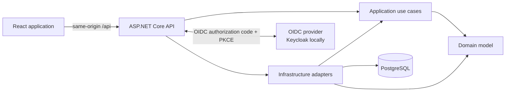
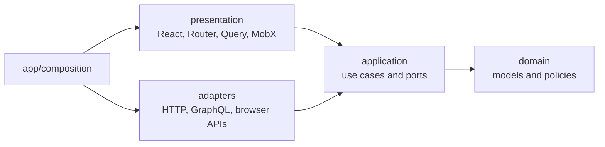

# TaskFlow

[](https://github.com/auauwolff/TaskFlow/actions/workflows/ci.yml)
[](LICENSE)

A reference architecture for full-stack applications: Clean Architecture in .NET on the backend,
feature-first Hexagonal Architecture in React on the frontend.

The domain is deliberately small — `User -> Project -> TaskItem` — because the subject here is the
boundaries, not the feature set. It is built to be read, discussed, and copied from when starting
something new.

## What it demonstrates

- **A dependency rule the compiler enforces.** Backend layering is expressed as project references,
  so an inward violation is a build error rather than a review comment.
- **Ports and adapters on both sides of the wire.** The same seam appears in C# and in TypeScript.
- **Two transports behind one architecture.** Projects use REST, tasks use GraphQL, both reach the
  same application services. Swapping a transport touches one adapter.
- **Provider-neutral authentication.** ASP.NET owns the OIDC flow and an `HttpOnly` cookie; the
  browser never sees a token and no identity-provider SDK reaches frontend code.
- **Rules that fail the build.** Layer direction, cross-feature imports, ambient clock usage, and
  the accuracy of the architecture diagrams are checked by tooling rather than by convention.

## Interactive architecture explorer

Run `pnpm --dir frontend dev` and open <http://localhost:5173/architecture>.

Start from the full-stack map, select a node to isolate its dependencies and consumers, then drill
into layers, modules, dependency-injection wiring, and source files. Two runtime lenses step outside
the structural graph: **sign-in flow** traces authentication end to end, and **DI inversion** follows
one port through both arrow systems, with a toggle that deletes the port to show what it was buying.

Worth opening first: **Frontend → In a nutshell**, the frontend with the features removed — one
anonymous slice and the machinery that serves it. Every feature is a copy of that shape.

The model is curated rather than generated, so it shows the edges that explain the architecture
instead of every incidental import. Tests hold it to the codebase.

The viewer itself is repository-agnostic: it takes a graph, a source provider, and an optional
architecture lens. Copying `frontend/src/features/architecture/presentation/explorer/` into another
codebase and writing one graph file is the whole integration — see that folder's README.

## Architecture



### Backend

Dependencies point inward. Inner layers know nothing about delivery or persistence.

| Project                   | Depends on                  | Responsibility                                            |
| ------------------------- | --------------------------- | --------------------------------------------------------- |
| `TaskFlow.Domain`         | Nothing                     | Entities, value objects, invariants, repository contracts |
| `TaskFlow.Application`    | Domain                      | Use cases, ports, DTOs, validation                        |
| `TaskFlow.Infrastructure` | Application, Domain         | EF Core, PostgreSQL, repository adapters, migrations      |
| `TaskFlow.Api`            | Application, Infrastructure | Controllers, GraphQL, authentication, composition root    |

Project references enforce these boundaries at compile time, and ASP.NET is the composition root.

Business rules live in the entities: `TaskItem` owns its state transitions and rejects invalid ones
rather than exposing setters for a service to orchestrate. Time is injected through `TimeProvider`,
and reaching for an ambient clock instead is a compile error. Optimistic concurrency uses
PostgreSQL's `xmin` as a shadow row version, translated inside Infrastructure into an
application-owned `ConflictException` so persistence details never reach a use case.

Both delivery mechanisms are thin. REST controllers and GraphQL resolvers call the same
`ITaskService`, and a test asserts their error translators produce the same vocabulary for the same
failure — a conflict means the same thing whichever transport reported it.

### Frontend

Feature-first Hexagonal Architecture. A feature creates only the layers it needs.



- `domain` holds models and pure policies. It imports no outer layer.
- `application` defines use-case contracts and ports.
- `adapters` implement those ports using HTTP, GraphQL, or browser APIs.
- `presentation` adapts application capabilities to React through focused view-model hooks.
- `app` is the composition root, combining feature registrations into one object graph.

#### The feature axis

That rule governs how code is arranged *inside* one feature. It says nothing about how features
relate to each other, and that is the boundary that decays as a codebase grows. Two rules govern it:

**A feature imports another feature only through its `index.ts`.** A deep import couples the consumer
to the other feature's folder layout, so moving a file becomes a cross-feature change.

**Shared vocabulary lives in `shared/domain`, and holds vocabulary only.** A type belongs there when
two or more features must agree on it and none may change it unilaterally. `UserId` and `ProjectId`
qualify — `Project.ownerId` being a `UserId` is not the session feature's private opinion. `TaskId`
does not: no other feature needs to name a task, so it stays in `features/tasks/domain`. That
asymmetry is the rule made visible. The kernel may not import a transport, a cache, or the container;
the moment it can, it stops being vocabulary and becomes a junk drawer.

The result is that exactly one feature-to-feature dependency exists — `TaskList` needs the signed-in
user to offer "assign to me" — and it goes through a published surface.

#### Composition

`createAppRuntime()` registers shared infrastructure, invokes each feature's `add*Module()`, and
builds the object graph before React renders. Feature code never receives the runtime or resolver.

`shared/ioc` is a framework-neutral typed container plus a React bridge, deliberately shaped like
`Microsoft.Extensions.DependencyInjection` so both composition roots read the same way. Typed symbol
tokens avoid string collisions and decorators. It rejects missing, duplicate, and circular
registrations, prevents singletons from capturing scoped services, and creates instances eagerly at
build time so `useService()` during render is a pure cache read rather than a side effect. A route
needing an isolated lifetime wraps its subtree in `ServiceScopeProvider` with a `scopeKey`. See
[`frontend/src/shared/ioc/README.md`](frontend/src/shared/ioc/README.md) for why the wheel was
rebuilt and what would have to change for an off-the-shelf container to win.

Ports stay TypeScript interfaces. Stateful adapters and application services are constructor-injected
classes. Components, hooks, registration functions, cache configuration, and pure domain operations
stay functions — a class earns its place through dependency ownership, state, or lifecycle, not
merely because the code lives outside React.

#### State ownership

| State | Owner |
| --- | --- |
| Server data (projects, tasks, session) | TanStack Query, over both transports |
| OIDC protocol, tokens, and session cookie | ASP.NET authentication adapter |
| Selected resource and shareable navigation state | Router path/search parameters |
| Form values and validation | React Hook Form |
| Project-scoped task filter | MobX view store |
| Other local interaction state | React |
| Stable gateways and services | Typed IoC registrations |

Server data is never copied into MobX, and components consume TaskFlow-owned presentation models
rather than the library's result objects. When state must be shared, choose its owner by meaning
rather than reach: API-derived data belongs to its feature's server-state engine, selections and
filters belong in the URL, form state belongs to React Hook Form, and transient interaction state
lifts to the nearest common component. A client store must never duplicate Query, Router, or form
state.

#### Transport boundary

`openapi-typescript` generates `src/shared/api/schema.d.ts` from the running API, and generated
transport types stay inside HTTP adapters. Adapters map DTOs and RFC Problem Details into frontend
models and `AppError`; components never import generated schemas or call `fetch`.

Tasks use a second delivery path behind an identical seam. `TasksGateway` is a plain application
port whose adapter posts typed GraphQL documents to `/api/graphql`. The GraphQL library is
deliberately demoted to a transport: `shared/graphql/client.ts` is a small typed `fetch` client
carrying the same antiforgery header and 401 policy as the REST client, and resolver errors are
translated through the same code-to-`AppError` table. Swapping a feature's transport replaces its
adapter and nothing else. The heterogeneous transports exist to prove that boundary is real.

Authentication follows the same shape. The session layer depends on an `AuthenticationGateway` whose
adapter calls stable TaskFlow endpoints, so replacing Keycloak with another provider does not change
a single frontend feature.

## Rules that fail the build

Architecture that lives only in documentation drifts. Each rule here is executable, and each was
verified to fail before being trusted.

| Rule | Enforced by |
| --- | --- |
| Backend layers may not depend outward | Project references |
| No warnings, current analyzers, enforced code style | `backend/Directory.Build.props` |
| No ambient clock — inject `TimeProvider` | `backend/BannedSymbols.txt` (RS0030) |
| Frontend layer direction, no circular imports | `.dependency-cruiser.cjs` |
| Cross-feature imports go through the front door | `cross-feature-imports-use-the-front-door` |
| The shared kernel holds vocabulary, not logic | `shared-kernel-holds-vocabulary-not-logic` |
| Migrations still match the EF model | `TaskFlow.Infrastructure.Tests` |
| The architecture explorer still describes this codebase | `architectureModel.test.ts` |
| All of the above, on every push | `.github/workflows/ci.yml` |

Dependency Cruiser runs with `tsPreCompilationDeps`, so `import type` counts. A type-only import is
erased at runtime but is still an architectural dependency: a domain layer importing a type from
another feature is coupled to it whether or not the bundler can tell.

The persistence tests run against a disposable PostgreSQL container, because the behaviour they check
belongs to PostgreSQL rather than to C#. SQLite and the in-memory provider have no `xmin` column, so
the concurrency token would silently do nothing and the tests would still pass. The schema comes from
running the real migrations, so a migration that has drifted from the model fails there too.

The explorer test answers a specific failure mode: a curated diagram of a moving codebase rots
silently, because a renamed file leaves a dead link and nothing fails. It asserts that every source
link resolves, every highlighted snippet is still present in the file it points at, every edge
connects nodes that exist, and every view is reachable. Highlights are anchored by code snippet
rather than line number so that drift breaks the suite instead of quietly mispointing.

## Stack

- .NET 10, ASP.NET Core controllers and Hot Chocolate GraphQL, EF Core, Npgsql, PostgreSQL
- OpenID Connect, secure cookie BFF, Keycloak for local development
- FluentValidation, Problem Details, Serilog, OpenAPI/Swagger
- React 19, TypeScript, Vite, TanStack Router/Query, a typed GraphQL fetch transport, MobX, React Hook Form
- xUnit, NSubstitute, FluentAssertions, Testcontainers, Vitest, Playwright, Dependency Cruiser, Oxlint

## Repository

```text
TaskFlow/
|-- backend/             .NET solution, production projects, and tests
|-- frontend/            React/Vite application, architecture rules, and browser tests
|-- infra/keycloak/      Local OIDC realm configuration
|-- .github/workflows/   CI running every check below
`-- docker-compose.yml   PostgreSQL and Keycloak development services
```

| Test project | Scope | Needs |
| --- | --- | --- |
| `TaskFlow.Domain.Tests` | Entity invariants and state transitions | — |
| `TaskFlow.Application.Tests` | Use-case orchestration over substituted ports | — |
| `TaskFlow.Infrastructure.Tests` | Value converters, concurrency tokens, migrations | Docker |
| `frontend/src/**/*.test.ts` | Domain, adapters, view models, architecture model | — |
| `frontend/e2e` | Real browser, API, PostgreSQL, and Keycloak login | Docker |

## Run locally

Prerequisites: .NET 10 SDK, the `dotnet-ef` tool, Docker Compose, and pnpm 10.

```bash
# Build the backend and start local infrastructure
dotnet build backend/TaskFlow.slnx
docker compose up -d postgres keycloak

# Apply the database migration and run the API
dotnet ef database update --project backend/src/TaskFlow.Infrastructure
dotnet run --project backend/src/TaskFlow.Api
```

In another terminal:

```bash
pnpm --dir frontend install
pnpm --dir frontend dev
```

Open `http://localhost:5173` and sign in as `ada` / `taskflow`. The committed credentials and OIDC
client secret are for local development only. The dev server proxies `/api` to the API, so start the
backend first.

| Service  | URL                                     |
| -------- | --------------------------------------- |
| Frontend | `http://localhost:5173`                 |
| Explorer | `http://localhost:5173/architecture`    |
| API      | `http://localhost:5131`                 |
| Swagger  | `http://localhost:5131/swagger`         |
| Keycloak | `http://localhost:8080`                 |

## Checks

```bash
dotnet build backend/TaskFlow.slnx
dotnet test backend/TaskFlow.slnx

pnpm --dir frontend lint
pnpm --dir frontend architecture
pnpm --dir frontend test
pnpm --dir frontend build
```

The build is the quality bar: `Directory.Build.props` sets warnings-as-errors, analyzers, and
enforced code style solution-wide, so there is no flag to remember. `dotnet test` includes the
Testcontainers-backed persistence tests, so Docker needs to be running.

The browser suite uses disposable PostgreSQL and Keycloak containers on separate ports, so it can run
beside the development stack without touching its volumes:

```bash
pnpm --dir frontend exec playwright install chromium
pnpm --dir frontend test:e2e
```

Run the API before regenerating the typed transport contracts:

```bash
pnpm --dir frontend generate:api        # OpenAPI -> TypeScript
pnpm --dir frontend generate:graphql    # SDL export -> typed documents
```
